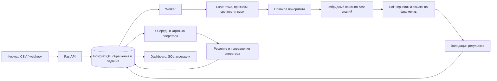

# AI Support Assistant: исследование и план реализации

Дата проверки документации: 3 октября 2026 года.

Обновление 4 октября: по решению пользователя начата реализация на Jev + DeepSeek. Текущая конфигурация и ограничения MVP описаны в README.md; исходное сравнение моделей ниже сохранено как исследование, а не текущая конфигурация приложения.

Прочитано исходное ТЗ: система определяет тему и срочность обращения, находит информацию в базе знаний, формирует ответ оператору; дополнительная задача — dashboard аналитики. Срок, команда, отрасль, данные и бюджет в ТЗ не заданы. План ниже рассчитан на хакатон 48 часов и команду из 3–4 человек. Это допущение, а не требование ТЗ.

## 1. Рекомендуемое решение

Сделать рабочее место оператора: очередь обращений → автоматическая классификация → поиск по базе знаний → черновик с источниками → редактирование и принятие оператором → аналитика.

Ключевой результат: оператор видит, почему обращение получило приоритет, на каких документах основан ответ и чего не хватает для решения. При недостатке сведений система задаёт уточняющий вопрос или предлагает эскалацию.

Стартовая конфигурация:

- Frontend: React + TypeScript + Vite, Tailwind, shadcn/ui, Recharts.
- Backend: Python + FastAPI + Pydantic + SQLAlchemy/Alembic.
- Хранилище: PostgreSQL + pgvector, полнотекстовый поиск и точный поиск по кодам ошибок.
- AI: `gpt-6-luna` для классификации; `gpt-6.1-sol` для подготовки ответа; `text-embedding-3-small` для векторов.
- Обработка: отдельный worker, задания и их состояния в PostgreSQL; Redis и полноценный брокер добавить при необходимости.
- Обновления интерфейса: SSE; загрузка данных через обычный REST API.
- Запуск: Docker Compose для воспроизводимого локального демо, затем размещение тех же сервисов на выбранной инфраструктуре.

Это инженерная рекомендация, а не доказанное превосходство моделей на ваших данных. Финальный выбор зависит от сравнения на одинаковом наборе обращений.

## 2. Какие модели использовать

Цены ниже — USD за 1 млн токенов, обычный API, без скидок за cache/batch; для OpenAI — короткий контекст.

| Задача / кандидат | Input / output | Решение |
|---|---:|---|
| GPT-6 Luna, `gpt-6-luna` | $0.10 / $0.50 | Основной классификатор; кандидат для простых ответов после проверки качества |
| GPT-6.1 Sol, `gpt-6.1-sol` | $2 / $10 | Основная модель черновиков в первом MVP |
| Gemini 3.1 Flash-Lite, `gemini-3.1-flash-lite` | $0.25 / $1.50 | Альтернатива классификатору |
| Gemini 3.8 Flash, `gemini-3.8-flash` | $0.75 / $3.75 до 31.12.2026 | Альтернатива модели ответов; вводный тариф |
| Claude Haiku 4.5, `claude-haiku-4-5` | $1 / $5 | Кандидат для быстрого pipeline, если тесты оправдают стоимость |
| Claude Sonnet 5.5, `claude-sonnet-5-5` | $2 / $10 | Кандидат для сложных ответов |
| text-embedding-3-small | $0.02 за input | Начальная модель embeddings |

Роли OpenAI и цены проверены по [каталогу моделей](https://developers.openai.com/api/docs/models), [прайсу](https://developers.openai.com/api/docs/pricing), страницам [Luna](https://developers.openai.com/api/docs/models/gpt-6-luna), [Sol](https://developers.openai.com/api/docs/models/gpt-6.1-sol) и [embeddings](https://developers.openai.com/api/docs/models/text-embedding-3-small). Другие кандидаты: [Gemini pricing](https://ai.google.dev/gemini-api/docs/pricing), [Gemini 3.8 Flash](https://ai.google.dev/gemini-api/docs/latest-model), [Claude pricing](https://platform.claude.com/docs/en/about-claude/pricing).

Для MVP держать одного основного провайдера. Проверить доступность моделей и лимиты API-аккаунта до начала реализации. Модели задавать через конфигурацию, сохранять model ID и версию prompt в каждом прогоне. Если доступны фиксированные версии, использовать их.

Для Luna начать с reasoning `none` или `low`; для Sol — `low`. Это настройки для эксперимента, а не обещание скорости. Более глубокое reasoning включать только при измеримом выигрыше. Не передавать всю базу знаний в каждый запрос.

Для локального поиска есть [BAAI/bge-m3](https://huggingface.co/BAAI/bge-m3), а для повторного ранжирования — [BAAI/bge-reranker-v2-m3](https://huggingface.co/BAAI/bge-reranker-v2-m3). Их multilingual-поддержка делает их кандидатами, но качество на казахском нужно проверить отдельно. Самостоятельный хостинг имеет стоимость вычислений и эксплуатации. Для хакатона локальную генеративную LLM вводить только при требовании работы без облака и наличии подходящего оборудования.

## 3. Архитектура



Pipeline — обычные функции и явные состояния. На первом этапе сложный агентный framework не нужен: действия заранее известны, а контроль сбоев важнее автономности.

Состояния: `queued`, `classifying`, `retrieving`, `drafting`, `ready`, `needs_review`, `failed`. Новое сообщение в диалоге инвалидирует старый черновик. Задание привязано к версии входных сообщений; устаревший результат не становится текущим.

Дедупликация по внешнему ID; повторяемые задания идемпотентны. Для API-сбоев — timeout, ограниченные retries с backoff/jitter. Исчерпание попыток видно оператору. Передача данных резервному провайдеру допустима только в рамках настроек компании.

## 4. Классификация и срочность

Начать с одной отрасли, например e-commerce: оплата, доставка, возврат, аккаунт, техническая ошибка, информация о продукте, другое. Одна основная тема и дополнительные метки решают проблему обращений с несколькими вопросами. Языки: русский; казахский и английский — если они нужны аудитории.

Классификатор возвращает валидируемый JSON: `primary_topic`, `secondary_topics`, `language`, `summary`, `impact`, `security_signals`, `urgency_evidence`, `missing_information`, `needs_human_review`. Поля ограничены схемой и enum. [Structured Outputs](https://developers.openai.com/api/docs/guides/structured-outputs) помогают соблюдать формат; формат не доказывает правильность вывода.

Срочность определять по последствиям и времени, а не эмоциональности:

| Приоритет | Пример основания | Действие |
|---|---|---|
| P0 | Подозрение на захват аккаунта, утечку или массовый критический сбой | Немедленная эскалация; подтверждение оператором |
| P1 | Денежная проблема или блокировка ключевого процесса без обхода | Высокий приоритет |
| P2 | Обычная проблема, есть обход или стандартный процесс | Стандартная очередь |
| P3 | Информационный вопрос без влияния на работу | Низкий приоритет |

Финальный приоритет вычисляет policy engine из признаков LLM, известных инцидентов и явных бизнес-правил. Возможный критический инцидент не равен подтверждённому инциденту. Сроки SLA задаёт компания; в демо использовать явно помеченную тестовую политику.

Показывать оператору конкретную причину: «клиент сообщает о двойном списании», а не скрытую цепочку рассуждений модели. Не показывать самозаявленные 95% уверенности как вероятность правильности. До калибровки достаточно статусов «нужна проверка» и причины.

## 5. База знаний и RAG

Для демо подготовить 30–50 согласованных статей одной компании. Все сроки возврата и условия должны существовать в этих документах. Не смешивать политики разных компаний.

Индексация:

1. Принимать Markdown, TXT, HTML и текстовые PDF; сканированные PDF с OCR отложить.
2. Сохранять документ, заголовок, язык, продукт, версию, период действия, доступ и источник.
3. Разбивать по разделам: стартовая настройка 350–650 токенов, overlap 50–100. Не разрывать условия, таблицы и пошаговые инструкции механически.
4. Добавлять заголовок статьи/раздела к индексируемому тексту.
5. Вычислять embeddings один раз на изменившийся фрагмент. Хранить модель, размерность, hash и версию документа.
6. Активировать новую версию индекса атомарно после завершения; не смешивать несовместимые embeddings.

Поиск: применить `tenant_id`, доступ, продукт и актуальность до отбора результатов → получить 20 семантических и 20 лексических кандидатов → объединить через Reciprocal Rank Fusion → убрать дубликаты → передать 4–6 фрагментов модели. Для RU — соответствующая конфигурация FTS, для KK — начать с `simple`, точного поиска и проверить на тестах. Не называть PostgreSQL FTS реализацией BM25: в MVP использовать его собственное ранжирование.

[Документация pgvector](https://github.com/pgvector/pgvector) описывает сочетание с полнотекстовым поиском PostgreSQL и RRF/cross-encoder. На небольшой базе можно начать с exact vector search; HNSW добавлять по результатам замеров.

Reranker включать после базового поиска, если он поднимает Recall@5 и не портит задержку. Произвольный cosine threshold вроде 0.8 не универсален: подобрать его на размеченных парах запрос–документ.

Генератор получает текст обращения, разрешённый контекст и найденные фрагменты с ID. Результат: `answer_status` (`draft`, `clarify`, `escalate`), `reply`, `citations`, `missing_information`, `operator_note`. Для значимых утверждений сохранять связи claim → chunk ID.

Если источников нет, не генерировать правила компании из памяти. Если источники противоречат друг другу, показать конфликт. Статус заказа или реальное списание проверяются в backend/CRM; база знаний содержит правила, а не актуальное состояние клиента. В MVP такие интеграции можно заменить явно помеченными тестовыми данными.

Backend проверяет наличие citation ID среди разрешённых найденных фрагментов. Такая проверка ловит выдуманные ссылки, но не доказывает поддержку утверждения текстом: это проверяют отдельные evals и оператор; для рискованных случаев добавить проверку entailment. Инструкции внутри обращения и статьи считать данными, не командами модели.

## 6. Интерфейс и аналитика

Три экрана:

- Очередь: тема, приоритет, краткое описание, статус обработки, возраст, фильтры и поиск.
- Карточка: история сообщений, причина приоритета, черновик, раскрываемые цитаты с версией источника; принять, изменить, отклонить, эскалировать. Сохранять исходный и финальный текст отдельно.
- База знаний и dashboard: загрузка/версия/статус индексации; аналитика с фильтром периода.

Минимальные метрики dashboard: обращения по времени, теме и приоритету; текущий backlog; возраст открытых; время до готового черновика p50/p95; доля без найденного ответа; acceptance rate; доля существенно изменённых ответов; стоимость AI на обращение; нарушения тестового SLA.

Каждая метрика имеет определённый знаменатель. Acceptance rate = принятые без изменений / рассмотренные черновики. Производительность AI и время работы оператора — разные метрики. CSAT показывать только при реальных ответах клиентов; экономию времени подтверждать сравнением одинаковых задач с AI и без AI. Агрегации рассчитываются SQL, LLM может лишь пояснить уже рассчитанные цифры.

Полезная отличительная функция — «пробелы базы знаний»: группировать неотвеченные запросы, показывать частоту и примеры. На старте достаточно группировки по темам; кластеризацию добавить позже.

## 7. Данные и API

Таблицы: `tickets`, `messages`, `jobs`, `classification_runs`, `documents`, `document_versions`, `chunks`, `drafts`, `draft_citations`, `operator_actions`, `ai_runs`, `ticket_events`. Общие поля: ID, `tenant_id`, временные метки. `ai_runs` хранит model, prompt version, input version, latency, token usage и рассчитанную стоимость. Чувствительный полный prompt не нужен в обычных логах.

Минимальные endpoints:

```text
POST /tickets                    -> ticket_id, job_id
GET  /tickets                    -> список с пагинацией
GET  /tickets/{id}                -> сообщения и анализ
POST /tickets/{id}/analyze        -> новое задание
GET  /tickets/{id}/events         -> SSE
PATCH /tickets/{id}               -> статус, тема, приоритет
POST /tickets/{id}/draft-actions  -> принять/изменить/отклонить
POST /knowledge/documents        -> загрузка
GET  /knowledge/documents        -> версии и состояние
GET  /analytics                  -> метрики периода
```

Принятие черновика в демо фиксирует действие оператора. Если будет подключён реальный канал, отправка оформляется отдельным действием с аудитом.

## 8. Качество: как выбирать модели

До оптимизации собрать 100–150 размеченных кейсов: обычные обращения, критические, неизвестные вопросы, неоднозначность, несколько тем, конфликт версий и prompt injection. Если нужны KK/EN, включить отдельные поднаборы и смешанные языки. Синтетические данные использовать для демо, а эффективность на реальных клиентах не заявлять без их проверки.

Отделить development-набор для prompts/thresholds от закрытого holdout. Для каждой модели дать одинаковую taxonomy и документы. Качество генерации сравнивать при фиксированном retrieval, чтобы не путать два источника ошибок.

| Метрика | Начальная цель MVP, не полученный результат |
|---|---|
| Темы | macro-F1 ≥ 0.85, отдельно по языкам |
| Критические обращения | recall ≥ 0.95; отдельно precision и ложные эскалации |
| Поиск | Recall@5 ≥ 0.90 на вопросах с известным ответом |
| Утверждения | ≥ 95% проверенных утверждений поддержаны источниками |
| Неизвестные вопросы | ≥ 90% корректных уточнений/эскалаций |
| Задержка | p95 до готового черновика ≤ 8 секунд при заданной нагрузке |

Отчитываться числами кейсов вместе с процентами: маленькая выборка даёт широкую неопределённость. LLM-as-judge использовать для предварительной проверки; критические случаи и часть обычных оценивать человеком.

Минимальные сравнения: Luna vs Flash-Lite для классификации; Sol vs Gemini 3.8 Flash для ответов; embedding-only vs hybrid search. Claude тестировать при оставшемся времени. Выбрать самый дешёвый вариант, прошедший пороги качества, с учётом задержки.

## 9. Стоимость

Пример нагрузки: 3 000 обращений в день, 90 000 в месяц. Допущения на обращение: классификация 800 input + 150 output; генерация 3 000 input + 400 output; embedding запроса 150 input. Reasoning, retries, история и повторные генерации могут увеличить расход.

```text
Luna: 800/1M × $0.10 + 150/1M × $0.50 = $0.000155
Sol:  3000/1M × $2 + 400/1M × $10 = $0.010000
Embedding: 150/1M × $0.02 = $0.000003
Итого: $0.010158 на обращение; $914.22 за 90 000.
```

Индексация базы в 1 млн токенов отдельно стоит $0.02 за embeddings. Это не включает хранение или вычисления.

Если после evals 80% черновиков делать Luna и 20% Sol, бюджет примера — около $230.22/месяц при маршрутизации ДО генерации. Если Sol запускается после неудачного ответа Luna, предыдущий вызов тоже оплачивается. Доля 80/20 — сценарий расчёта, не наблюдённый результат.

Вариант Gemini: Flash-Lite для классификации + 3.8 Flash для всех черновиков — примерно $376.02/месяц при тех же условных токенах и embeddings OpenAI. Это расчёт по вводному тарифу Flash; реальный tokenizer и thinking расход отличаются. Тариф проверять при продлении.

Для 1 000 тестовых обращений базовая конфигурация — около $10.16 без дополнительных расходов. На эксперименты разумно выделить $20–50 как рабочий бюджет. Инфраструктуру считать отдельно по выбранному хостингу; здесь её актуальные тарифы не исследованы.

## 10. План на 48 часов

| Время | Работа | Проверяемый результат |
|---|---|---|
| 0–4 ч | Выбрать отрасль, taxonomy, правила приоритетов; получить ключи; сделать 30 статей и первые 30 кейсов | Есть согласованные примеры и доступ к API |
| 4–12 ч | БД, API, worker, загрузка документов, embeddings и первый поиск | Новое обращение находит подходящую статью |
| 12–20 ч | Классификация JSON, policy engine, генерация и citations, обработка ошибок | Полный сценарий работает через API |
| 20–28 ч | Очередь, карточка, просмотр источников, решения оператора | Рабочий интерфейс с сохранением действий |
| 28–34 ч | Dashboard и seed-импорт обращений | Метрики связаны с событиями БД |
| 34–42 ч | Holdout-evals, сравнение моделей, RU/KK проверки, unknown/injection/version cases | Таблица качества, стоимости и задержки |
| 42–48 ч | Проверка запуска с нуля, deployment/rehearsal, сценарий защиты | Воспроизводимый demo и результаты evals |

Распределение для 4 участников: frontend; API/данные; AI/retrieval; тестовые данные/evals/демо. Каждый этап интегрировать в общий сценарий сразу. Для 24 часов убрать reranker, дополнительные провайдеры, кластеризацию и внешние интеграции; сохранить источники, эскалацию и измерение качества.

## 11. Демонстрация жюри

1. Загрузить новую статью об условиях возврата и дождаться её индексации.
2. Подать вопрос о возврате: тема, приоритет, ответ, ссылка на нужный раздел.
3. Подать сообщение о двойном списании: поднятый приоритет с конкретной причиной, предложение проверки оператором без выдуманного подтверждения транзакции.
4. Подать вопрос без ответа в документах: уточнение или эскалация.
5. Изменить и принять ответ; показать запись действия и обновление dashboard.
6. Показать результаты закрытого набора и измеренную стоимость, отдельно от синтетической нагрузки.

Demo должно включать хотя бы одно живое обращение. Если сеть недоступна, воспроизводимый записанный прогон допустим с явной пометкой.

## 12. После хакатона

Первые 1–2 недели пилота: реальные обезличенные обращения, бизнес-политика SLA, доступы, проверка языка, мониторинг и реальные измерения времени оператора. Следующий этап: интеграции с CRM/каналами, управление знаниями, нагрузочные проверки и маршрутизация дешёвой модели.

До подключения реальных клиентов нужны: серверное хранение ключей; проверка принадлежности tenant на каждом запросе и поиске; роли; аудит; политика удаления данных; ограничение форматов/размеров загрузки; безопасное отображение HTML; редактирование PII в логах. Передача данных в облачные модели должна соответствовать правилам компании. Для Gemini документация отличает использование данных free и paid tiers; реальные обращения не брать для экспериментов на free tier без согласованной политики.

Не включать в первую версию обучение собственной LLM, голос, много интеграций, Kubernetes, сложную многоагентную систему или автоматическую отправку клиентам. Приоритет реализации: качественные документы → поиск → корректный черновик с источниками → действия оператора → аналитика → оптимизация цены.
